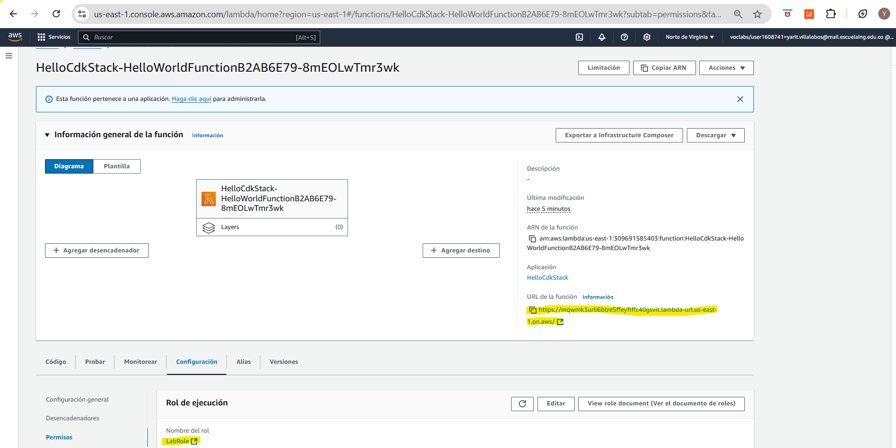

# Descripción

Uso básico de CDK, creación de un proyecto cdk, que despliega la creación de una Lambda usando un role predeterminado y colocando un recurso url para acceder a la página

## Creación del Stack

Se hizo la creación del stack donde se hace la definición de la lambda, se agrega la url del recurso y se define que use un rol por defecto para los permisos de la lambda

## Creación main para ejecución del stack 

Se hizo el main del stack donde iniciara el stack y se definio su nombre como **"HelloCdkStack"**

## Creación de recursos necesarios para la ejecución de roles

El comando **"cdk bootstrap"** crea los recursos necesarios como un bucket, un parameter store y unos roles para poder desplegar los stacks desde el comando "cdk deploy", sin embargo en nuestro caso no tenemos el permiso para la creación de roles por tanto se tuvo que modificar el template documentando la creación de los diferentes roles. Ademas para ejecutar el comando toda especificar el archivo yml para que haga la creación de los recursos con el yaml dado **"cdk bootstrap --template {namefile.yaml}"**

## Listar stacks 

El comando **"cdk ls"** muestra los stacks que contiene la aplicación

## Muestra los cambios que se realizaran

El comando **"cdk diff {stackName}"** muestra los cambios que realizara con respectoa la última ejecución del stack, en este caso como es la primera vez que se realizara, muestra solamente la creación de la lambda

## Desplegar infrastructura con Ckd

El comando **"cdk deploy {stackName}"** despliega los cambios, en este caso la creación de la lambda. Debido que no existen los roles predeterminados para la ejecución de este comando toca indicar con el rol que se va a ejecutar este despliegue, para esto el comando sería **"cdk deploy -r {RoleName} {stackName}"**.

## Observando el recurso creado

Aquí se puede observar que se creo el recurso con las especificaciones que se dieron desde el stack y que la aplicación funciona correctamente

# Autores

* Yarit Yajanny Villalobos Jimenez

# Welcome to your CDK Java project!

This is a blank project for CDK development with Java.

The `cdk.json` file tells the CDK Toolkit how to execute your app.

It is a [Maven](https://maven.apache.org/) based project, so you can open this project with any Maven compatible Java IDE to build and run tests.

## Useful commands

 * `mvn package`     compile and run tests
 * `cdk ls`          list all stacks in the app
 * `cdk synth`       emits the synthesized CloudFormation template
 * `cdk deploy`      deploy this stack to your default AWS account/region
 * `cdk diff`        compare deployed stack with current state
 * `cdk docs`        open CDK documentation

Enjoy!
"# AYGO-CDK" 
